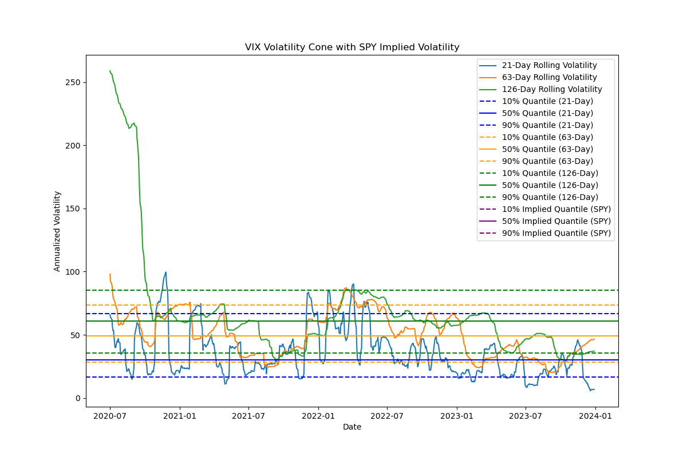

# Volatility Cone Data Analysis 
## Overview

This project analyzes volatility characteristics in financial markets using both historical volatility and implied volatility data. By constructing volatility cones over different time periods, the project aims to assist in risk management and trading strategy decisions. The analysis is performed using the VIX index for historical volatility and SPY options data for implied volatility.

## Features

 **Historical Volatility Calculation**:
   - Use rolling windows (21, 63, 126 days) to compute annualized volatility from VIX data.
   - Calculate and visualize quantiles (10%, 50%, 90%) of historical volatilities.

 **Implied Volatility Calculation**:
   - Retrieve SPY options data and calculate implied volatility using the Black-Scholes model.
   - Filter expired contracts and calculate quantiles (10%, 50%, 90%) for implied volatility.

 **Volatility Cone Construction**:
   - Overlay historical volatility and implied volatility quantiles on a single graph.
   - Provide insights into market volatility trends over different time frames.


## Directory Structure
```plaintext
volatility-cone/
├── data/                       # Folder for data files
│   └── vix_data.csv            # VIX historical implied volatility data
├── src/                        # Source code folder
│   └── main.py                 # Module for volatility cone calculations and analysis
├── results/                    # Folder for output results and charts
│   ├── VIX_volatility.csv 
│   └── volatility_cone.png #Generated graphs and analysis outputs.
├── README.md                   # Project description file
└── requirements.txt            # Project dependency file
```


## Data Collection

This project collects and processes two main datasets: **VIX data** and **SPY options data**.

**VIX Data (Historical Volatility)**
- VIX data is retrieved using the `yfinance` library from Yahoo Finance.
 **Download Code**
```python
import yfinance as yf

print("download VIX data...")
vix_data = yf.download('^VIX', start='YYYY-MM-DD', end='YYYY-MM-DD')
```

 
#### **ALSO CAN check VIX data from the CBOE website and save it as vix_data.csv. The VIX data will represent overall market implied volatility.**

 [Google](https://www.cboe.com)


## Analysis Workflow

1. **Data Cleaning and Processing**
   - Download VIX data (`^VIX`) to represent historical volatility.
   - Remove missing values using `.dropna()` to ensure data consistency.

2. **Calculate Historical Volatility Cone**
   - Use 1-month (21 days), 3-month (63 days), and 6-month (126 days) rolling windows to calculate annualized historical volatilities.
   - Compute quantiles (10%, 50%, 90%) for each time frame to construct the historical volatility cone.

3. **Construct Implied Volatility Cone**
   - Retrieve SPY options data and calculate implied volatilities using the Black-Scholes model.
   - Compute quantiles (10%, 50%, 90%) for implied volatility to construct the implied volatility cone.

4. **Visualization**
   - Save the results to an output folder for further analysis.

## Example Result

Below is the output of the project:




---

---


---

